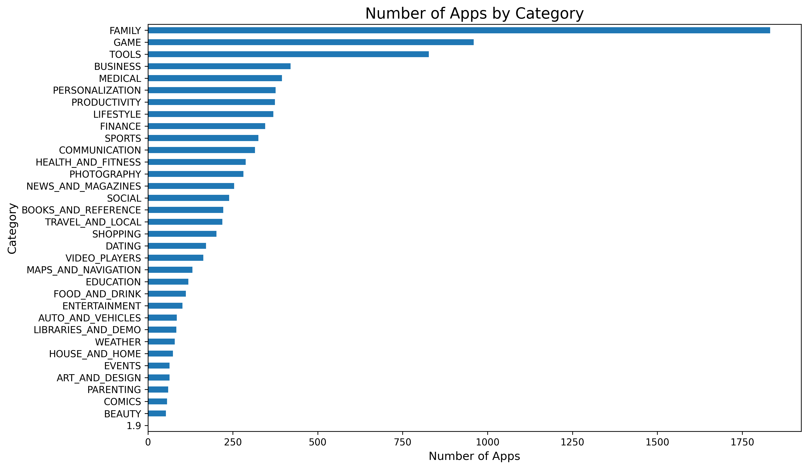
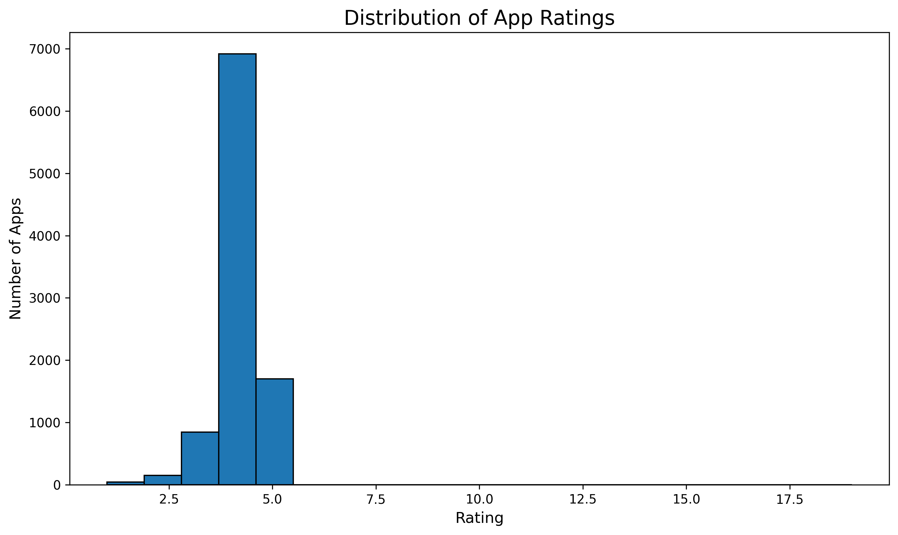
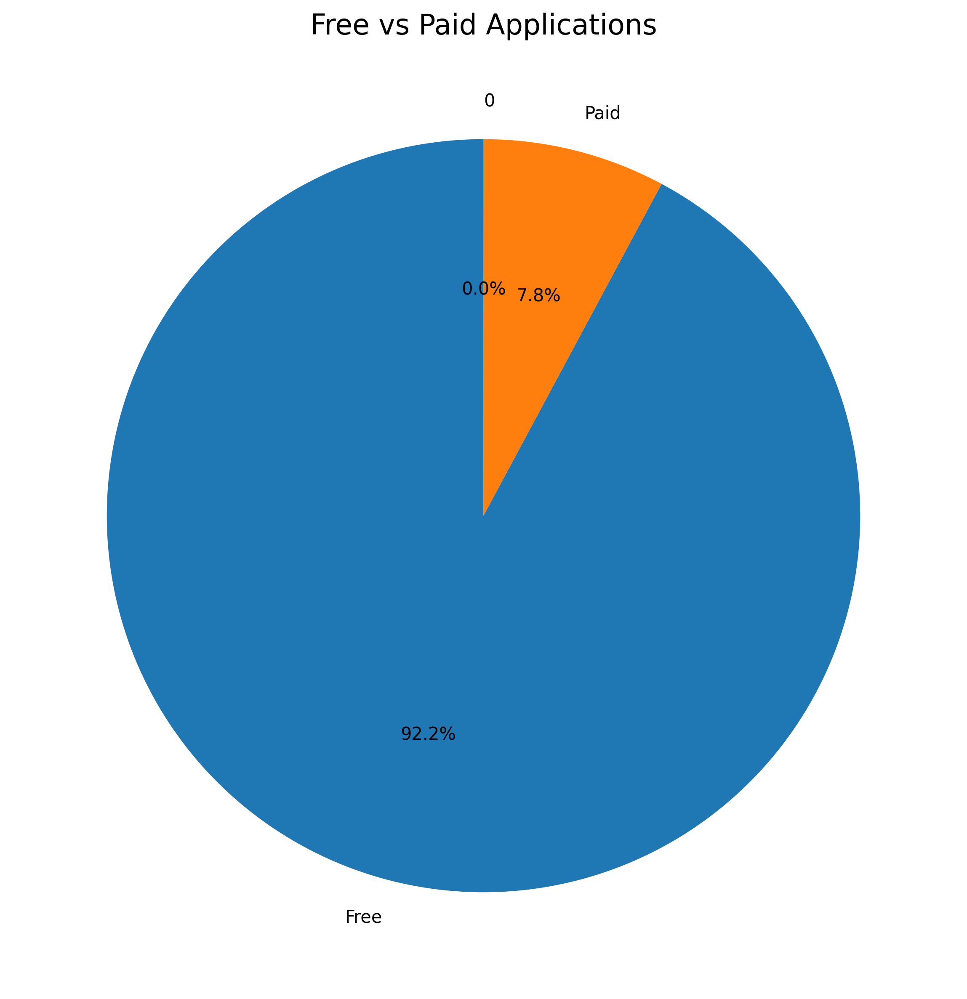
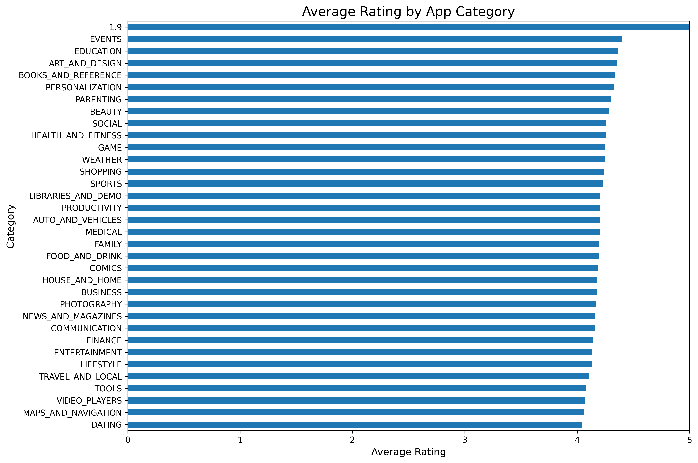
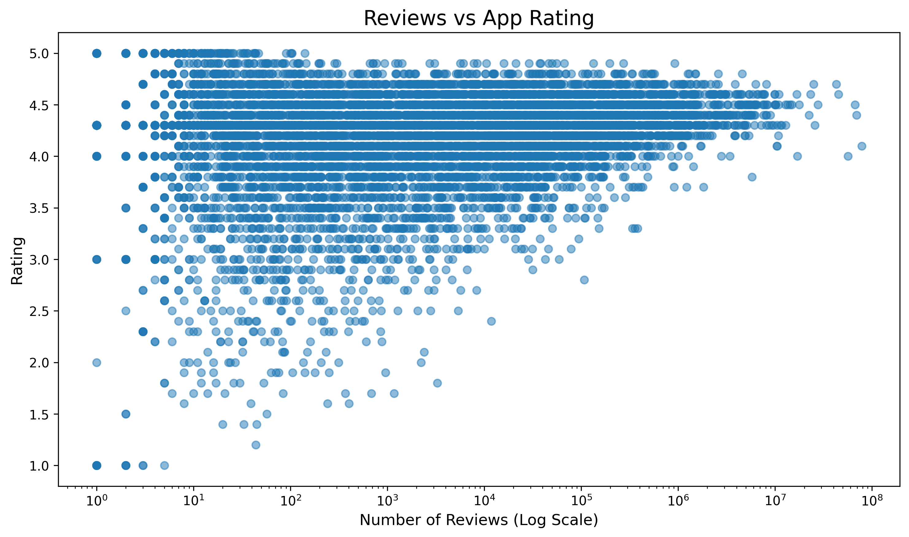
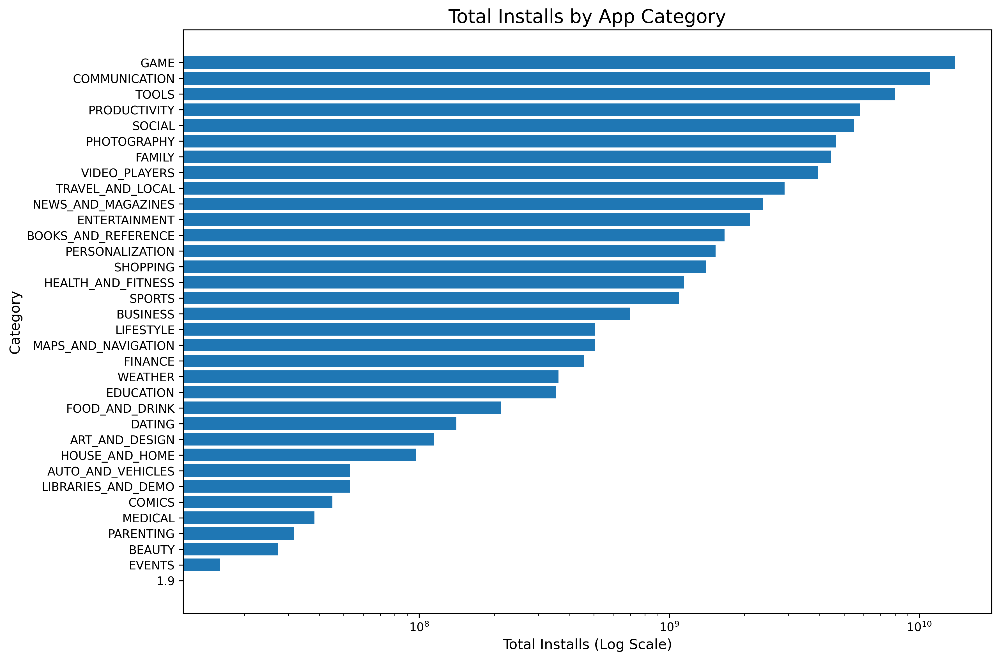
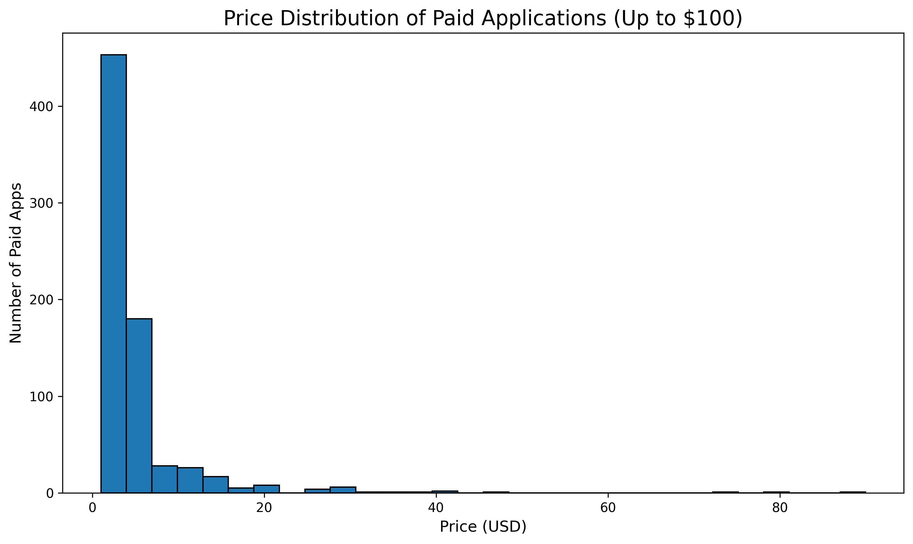
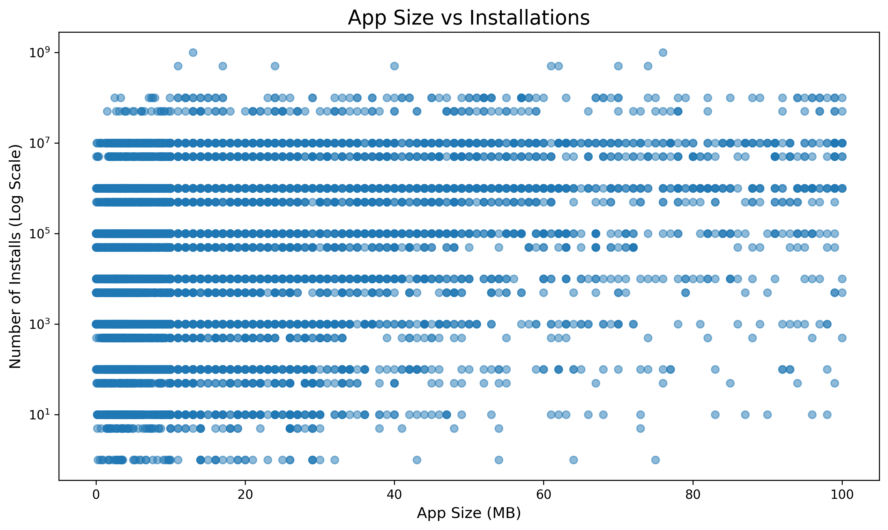

# Google Play Store App Market Analysis Using Python

## TEAM MEMBERS
1) MANN MRUG :- IU2441230596
2) VEDANT JOSHI :- IU2441230651

## 1. Project Overview

This project analyzes the Google Play Store Apps dataset using Python and Exploratory Data Analysis (EDA) techniques.

The main objective is to identify patterns and trends in mobile applications based on:

- App categories
- Ratings
- Reviews
- Number of installations
- Pricing
- App size
- Content ratings
- Free vs paid applications

The analysis helps understand the characteristics of successful and popular applications on the Google Play Store.

---

## 2. Dataset

### Dataset Name

**Google Play Store Apps**

### Source

Kaggle:  
https://www.kaggle.com/datasets/lava18/google-play-store-apps

### Dataset Description

The dataset contains information about applications available on the Google Play Store.

Important attributes include:

| Column | Description |
|---|---|
| App | Name of the application |
| Category | Application category |
| Rating | User rating of the application |
| Reviews | Number of user reviews |
| Size | Application size |
| Installs | Number of installations |
| Type | Free or Paid |
| Price | Application price |
| Content Rating | Target audience |
| Genres | Application genre |
| Last Updated | Date of last update |
| Current Ver | Current application version |
| Android Ver | Required Android version |

---

## 3. Project Objectives

The major objectives of this project are:

1. Analyze the distribution of applications across different categories.
2. Understand the distribution of application ratings.
3. Compare free and paid applications.
4. Identify categories with higher average ratings.
5. Analyze the relationship between reviews and ratings.
6. Compare total installations across categories.
7. Analyze the pricing of paid applications.
8. Study the relationship between application size and installations.

---

## 4. Data Cleaning

The original dataset contains missing values, duplicate applications, and non-numeric values.

The following preprocessing steps were performed:

### Duplicate Removal

Duplicate applications were identified and removed based on the `App` column.

### Missing Ratings

Missing values in the `Rating` column were replaced using the median rating.

### Reviews

The `Reviews` column was converted into numeric format.

### Installations

Values such as:

```text
10,000+
100,000+
1,000,000+
```

were converted into numeric values by removing commas and the `+` symbol.

### Price

The `$` symbol was removed and prices were converted into numeric values.

### App Size

Application sizes were converted into MB.

Values such as `k` were converted from KB to MB, while `Varies with device` was treated as missing.

### Last Updated

The `Last Updated` column was converted into a proper date format.

---

## 5. Data Visualizations

### 5.1 Number of Apps by Category

This visualization shows how applications are distributed across different Google Play Store categories.

**Expected insight:** Identify the categories containing the largest number of applications.



---

### 5.2 Distribution of App Ratings

This histogram shows the distribution of application ratings.

**Expected insight:** Understand the most common rating range and overall rating distribution.



---

### 5.3 Free vs Paid Applications

This chart compares the number of free and paid applications.

**Expected insight:** Determine whether the Google Play Store dataset is dominated by free or paid applications.



---

### 5.4 Average Rating by App Category

This visualization compares the average rating of applications across categories.

**Expected insight:** Identify categories with relatively higher and lower average ratings.



---

### 5.5 Reviews vs App Rating

This scatter plot analyzes the relationship between the number of reviews and application ratings.

**Expected insight:** Determine whether applications with more reviews tend to have different rating patterns.



---

### 5.6 Total Installs by App Category

This chart compares total installations across application categories.

**Expected insight:** Identify categories with the greatest installation reach.

> Note: The original dataset provides installation ranges such as `10,000+` and `1,000,000+`. Therefore, installation totals represent approximate lower-bound values.



---

### 5.7 Price Distribution of Paid Applications

This histogram analyzes the prices of paid applications.

For visualization purposes, applications priced above $100 were excluded from this particular plot because extreme values can make the distribution difficult to interpret.

**Expected insight:** Understand the typical price range of paid applications.



---

### 5.8 App Size vs Installations

This scatter plot studies the relationship between application size and number of installations.

**Expected insight:** Determine whether application size appears to be associated with installation count.



---

## 6. Python Libraries and Tools

The following technologies were used:

- **Python** — Programming language
- **Google Colab** — Data analysis and visualization environment
- **Pandas** — Data loading, cleaning and analysis
- **NumPy** — Numerical operations
- **Matplotlib** — Data visualization
- **Seaborn** — Statistical visualization
- **GitHub** — Version control and project documentation
- **Kaggle** — Dataset source

---

## 7. Project Workflow

```text
Kaggle Dataset
      ↓
Download CSV
      ↓
Upload Dataset to GitHub
      ↓
Data Cleaning
      ↓
Cleaned Dataset
      ↓
Exploratory Data Analysis
      ↓
Data Visualization
      ↓
Insights and Findings
      ↓
Final Report
```

---

## 8. Team Contribution

### Person 1 — Data Cleaning

Responsibilities:

- Dataset loading
- Data inspection
- Missing value handling
- Duplicate removal
- Data type conversion
- Installation conversion
- Price conversion
- Size conversion
- Cleaned dataset generation

Notebook:

`notebooks/01_data_cleaning.ipynb`

### Person 2 — Data Visualization

Responsibilities:

- Loading cleaned dataset
- Exploratory data analysis
- Creating charts
- Generating statistical insights
- Saving visualization plots

Notebook:

`notebooks/02_visualizations.ipynb`

### Both Members

- Project documentation
- Analysis and interpretation
- Final report
- GitHub repository management

---

## 9. Key Findings

The analysis is designed to answer the following questions:

- Which app categories contain the most applications?
- What rating range is most common?
- Are most applications free or paid?
- Which categories have the highest average ratings?
- Is there a relationship between reviews and ratings?
- Which categories have the highest installation reach?
- What is the typical price of paid applications?
- Does application size appear to affect installations?

The numerical findings are generated directly from the Python analysis notebooks.

---

## 10. Limitations

The project has several limitations:

1. The dataset represents a historical snapshot of the Google Play Store.
2. Installation values are provided as ranges rather than exact numbers.
3. Missing values are present in some columns.
4. Some application information may be outdated.
5. Correlation between variables does not imply causation.
6. The analysis is limited to the variables available in the dataset.

---

## 11. Repository Structure

```text
google-play-store-analysis/
│
├── README.md
│
├── dataset/
│   ├── googleplaystore.csv
│   └── cleaned_data.csv
│
├── notebooks/
│   ├── 01_data_cleaning.ipynb
│   └── 02_visualizations.ipynb
│
└── plots/
    ├── 01_apps_by_category.png
    ├── 02_rating_distribution.png
    ├── 03_free_vs_paid.png
    ├── 04_category_average_rating.png
    ├── 05_reviews_vs_rating.png
    ├── 06_category_installs.png
    ├── 07_price_distribution.png
    └── 08_size_vs_installs.png
```

---

## 12. Project Repository

GitHub Repository:

https://github.com/kratos2756/google-play-store-analysis

---

## 13. Conclusion

This project demonstrates how Python can be used to clean, analyze, visualize, and interpret real-world application data.

Through exploratory data analysis and visualization, the project provides insights into application categories, ratings, reviews, installations, pricing, and application size.

The project also demonstrates a complete data analysis workflow from raw Kaggle data to cleaned data, visualizations, findings, and documented results.
